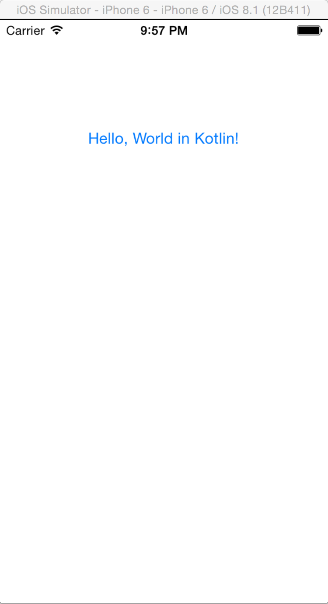

# RoboVM Template Project
An out of the box working *RoboVM* template project for *IntelliJ IDEA*, **Maven**, and **Gradle** in order to build iOS apps.
Currently it’s not possible to start the application from IntelliJ IDEA.

## Getting Started
* Prerequisites
	* Xcode
	* Java JDK 8

* The initial build takes around 2min.
	All subsequent builds are substantially faster.

* Run with Maven 
	`mvn clean compile robovm:create-ipa robovm:iphone-sim`
	
	* Run a “Hello, World!” app written in ***Kotlin***
	
	`mvn clean compile robovm:iphone-sim -D robovm.mainClass=net.loxal.example.kotlin.ios.HelloWorld`

	

* Run with Gradle `gradle clean build createIPA launchIPhoneSimulator`
	* tested with v2.2.1

## References

* [RoboVM Project](http://www.robovm.com)
* [RoboVM Samples](https://github.com/robovm/robovm-samples)
* [JavaFX on iOS & Android](http://javafxports.org)
* [Tired of being stuck with Java 7 syntax on Android? Target Android with Kotlin!](http://kotlinlang.org)
